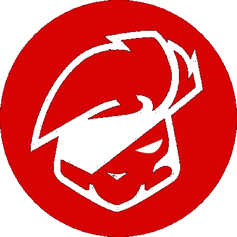

# K4RAGA App

<p align="center">
  
</p>

<p align="center">
  <strong>Next.js-хаб для K4RAGA: главная страница, CS-тренировка и FACEIT watch.</strong>
</p>

<p align="center">
  <a href="https://k4raga.ru/">k4raga.ru</a>
  ·
  <a href="https://cs.k4raga.ru/">cs.k4raga.ru</a>
  ·
  <a href="./docs/ARCHITECTURE.md">Architecture</a>
  ·
  <a href="./docs/DEPLOYMENT.md">Deployment</a>
</p>

<p align="center">
  
  
  
  
</p>

## Что это

`k4ragaApp` — компактное веб-приложение для доменов K4RAGA.

На основном домене оно работает как простая разводная страница. На CS-поддомене открывает конструктор тренировочной сессии, отдельный режим прохождения тренировки и страницу наблюдения за последними FACEIT-матчами benchmark-пула игроков.

## Возможности

- Host-aware root: `/` показывает разные интерфейсы для `k4raga.ru` и `cs.k4raga.ru`.
- Конструктор CS-сессии с пресетами длительности, блоками тренировки, фокусами и drag-and-drop-сборкой.
- Отдельная страница прохождения активной тренировки.
- Сохранение выбранной сессии, фокусов и прогресса в `localStorage`.
- FACEIT watch: ручная загрузка последних матчей benchmark-пула за 7 дней.
- Единые тексты интерфейса в `lib/copy.js` и отдельная модель тренировочных данных.

## Маршруты

| Route | Назначение |
| --- | --- |
| `/` | Главная на `k4raga.ru`; конструктор на `cs.k4raga.ru` |
| `/builder` | Прямой вход в конструктор тренировки |
| `/training` | Прохождение собранной CS-сессии |
| `/faceit` | FACEIT watch-экран |
| `/api/faceit-watch` | Серверный сбор матчей для FACEIT watch |

## Стек

- Next.js 14
- React 18
- CSS Modules и обычные CSS-файлы
- `localStorage` для клиентского состояния тренировки
- `fetch` на серверном route handler для FACEIT watch

## Структура

```text
app/
  page.jsx                  # host-aware root
  builder/page.jsx          # прямой route к конструктору
  training/page.jsx         # прохождение тренировки
  faceit/page.jsx           # FACEIT watch
  api/faceit-watch/route.js # серверный сбор матчей
components/
  BuilderScreen/            # UI конструктора
  FaceitWatchScreen/        # UI FACEIT watch
  SiteChrome/               # общий chrome приложения
  Topbar/                   # навигация
lib/
  copy.js                   # тексты интерфейса
  training-data.js          # контентная модель тренировки
  training-state.js         # чтение, запись и мутации состояния
  faceit-watch-data.js      # benchmark-пул игроков
docs/
  ARCHITECTURE.md
  DEPLOYMENT.md
```

## Локальный запуск

```bash
npm install
npm run dev
```

Прод-сборка:

```bash
npm run build
npm run start
```

По умолчанию `npm run start` запускает Next.js на порту `3000`.

## Состояние тренировки

Тренировочная сессия хранится в браузере:

- выбранные блоки;
- выбранные фокусы;
- случайно собранные фокусы для прохождения;
- отметки завершения.

Ключевая логика состояния лежит в `lib/training-state.js`, поэтому `builder` и `training` не дублируют одни и те же мутации.

## Deploy

Прод-окружение сейчас описано в [`docs/DEPLOYMENT.md`](./docs/DEPLOYMENT.md): `nginx`, `pm2` и `next start -p 3000`.

Перед выкладкой:

```bash
npm run build
```

## Принципы проекта

- Один небольшой проект без лишних слоев.
- `builder` и `training` разделены по ответственности.
- Данные тренировки лежат отдельно от UI.
- Интерфейс можно менять без переписывания контентной модели.
- Приватные операционные заметки и release-архивы не входят в публичное описание проекта.
